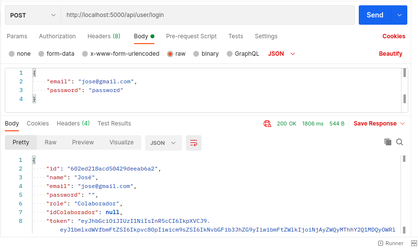
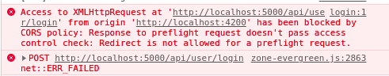

# Portal Web

Este é um projeto em desenvolvimento para testar habilidades para vaga em full-stack. O objetivo é construir uma aplicação com cadastro e login de usuário, visualização de usuários cadastrados e processo em background no servidor. As tecnolgias utilizadas são Angular 11, .NET 5, MongoDB e Docker. Comecei este projeto sem experiência com nenhuma das tecnologias citadas.

## Estrutura do projeto

### Containers com Docker

O Docker é utilizado aqui para 2 containers: um para o banco em MongoDB e outro para o servidor em .NET 5. O banco pode ser acessado pelo `localhost:8081`. A API no servidor pode ser acessada por `localhost:5000`. Um container ainda não foi configurado para o cliente. Este projeto usa `docker-compose` portanto, para rodar este projeto, em `portal-web` rode

```bash
docker-compose up
```

e, em `portal-web-client`, rode

```bash
npm start
```

### Banco de dados

A configuração do banco de dados está no `docker-composer`. Configurações de usuário ainda não foram feitas para facilitar o desenvolvimento inicial. O arquivo `portal-web-db/mongo-init.js` insere dados iniciais com algumas contas. Um exemplo é `jose@gmail.com` com senha `password`.

### Servidor

O servidor foi construído usando [este exemplo](hhttps://balta.io/artigos/aspnet-5-autenticacao-autorizacao-bearer-jwt). A primeira preocupação foi fazer um método de login. Escolhi usar autenticação via token. Os endpoints implementados podem ser visualizados em `localhost:5000/swagger/`. O endpoint `/api/user/login` verifica se a combinação de usuário e senha está correta e retorna um token. O que está pronto aqui é o login sem o hashing e o salting.

O servidor possui `Models` para as interfaces dos dados que podem ser coletados do banco de dados, `Repositories` que fazem as alterações e consultas no banco, `Services` quem chamam métodos dos repositórios para realizar operações além de alterações simples e consutlas e `Controllers` que implementa os endpoints da API.

Você pode aqui interromper o container dedicado ao servidor e rodar `dotnet run` para rodar o servidor em modo de desenvolvimento.

### Cliente

O cliente foi construindo usando [este exemplo](https://jasonwatmore.com/post/2020/07/09/angular-10-jwt-authentication-example-tutorial). O cliente possui um `_helper/auth.guard.ts` que verifica se o usuário que está acessando uma rota possui as devidas permissões. O `_helper/jwt.interceptor.ts` intercepta requisições via `@angular/common/http` adicionando o token de autorização quando houver.

## Problemas

Nada aqui está funcionando ainda. O próximo passo é garantir que o login está funcionando via cliente. O endpoint funciona usando Postman.



Ao realizar o login, o seguinte erro acontece no Google Chrome:



Em vez de fazer a requisição POST para realizar o login, uma requisição OPTIONS é feita antes. Como não é um objeto do tipo `User` que o cliente espera, um erro acontece. Neste momento, estou tentando entender esse erro, o que é o preflight request e como configurar CORS corretamente, tanto no servidor como no cliente. O objetivo atual é passar por este erro para seguir com os outros requisitos do projeto.

Além disto, preciso entender como funciona a biblioteca de http do Angular. No exemplo, vi uma grande vantagem pelo HttpInterceptor, usando uma cadeia de responsabilidade para tratar requisições.

## Problemas superados

### Docker e .NET 5

Nunca havia trabalhado com Docker e .NET 5 antes. Tive alguns problemas para fazer funcionar na minha máquina. Minha máquina não é boa o suficiente para rodar Docker e Visual Studio 2019 ao mesmo tempo no Windows 10. Então foi necessário usar o meu Arch Linux usual. Havia tentado usar Windows 10 porque os tutoriais se aproveitam bastante das funcionalidades do Visual Studio, mas pois vi que o CLI do .NET é suficiente.

Outro problema que eu tive foi ao criar o container para o servidor. Depois de pedir ajuda para colegas que já trabalharam com Docker antes, vi que na rede entre containers do Docker, uma container é identificado pelo nome na configuração do `docker-compose`, portanto, precisaria colocar `mongo:27017` como endereço do bando nas variaveis de produção do servidor.

## API

Segue a documentação da API. Exemplos de requisições estão disponíveis em `Portal Web.postman_collection.json`.

### POST /login

Realiza login de um usuário. Body é um JSON com os campos `email` e `password`.

### POST /colaborador

Realiza o cadastro de um usuário Colaborador. Body é um JSON com `name`, `email`, `password`.

### GET /cliente

Com usuário colaborador logado, retorna todos os clientes de um usuário.

### POST /cliente

Com usuário colaborador logado, realiza o cadastro de um usuário Cliente. Body é um JSON com `name`, `email` e `password`.
